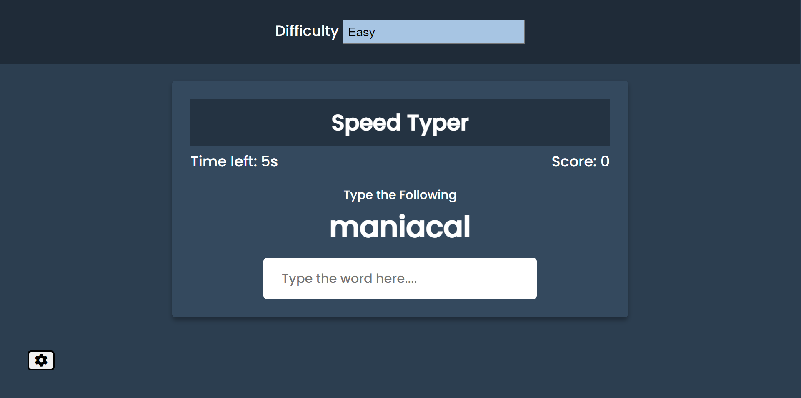

# Typing Game 
`Author:` Padmanabh Belavadi

This is the project based on the idea of `Typing Test`. it is completely build using core `HTML` `CSS` and `Javascript`
In this game certain time is gin to complete the word typing on typing speed the score will be incremented.
on th basis on difficulty level the timing is reduced to speed up the typing.

## My Project Looks Like :

## Reach Me Out on

 [Linkedin](https://www.linkedin.com/in/padmanabh-belavadi)

 [GitHub](https://github.com/padmanabh-b)

 [Instagram](https://www.instagram.com/legend_padmanabh/)

 [Findcoder](https://www.findcoder.io/u/padmanabh_b)

# Deployed Link